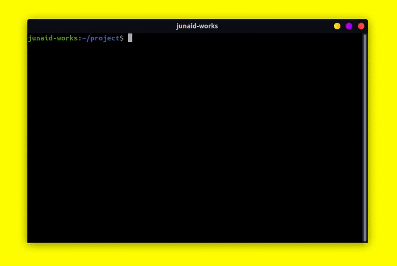

<br />
<div align="center">


[](https://codecov.io/gh/junaid-home/fly-commit)
[](http://npmjs.com/package/fly-commit)
[](http://npmjs.com/package/fly-commit)

</div>
<p align="center">
fly-commit is currently tested against node version 12 and 15 although it may work in older node versions. You should also have npm version 6 or higher.
</p>
<br />


# Install

Installation is straight forward, simply run the following command.

```bash
npm install -g fly-commit
```

or, if you are using npm version 5.2 or higher, you can run this cli directly without installing it globally.

```bash
npx fly-commit
```


# Usage

Simply use `fly-commit` or just `commit` instead of git commit when committing. You can also use `fc`, which is an alias for `fly-commit`.

When you commit with `fly-commit`, you'll be prompted to fill out any required commit fields at commit time and your commit message will be formatted according to the standards defined by us.



# ⚡ Commiting with Flags

optionally, you can also commit with cli flags and inputs.

```
commit <COMMANDS> [OPTIONS]

OPTIONS
-h, --help      Show usage guide
-v, --version   Print current version of fly-commit
-t, --title     Title of commit message
-d, --desc      Description of commit message (Optional)
--no-emoji      Don't include emoji in final output

COMMANDS
fix             A bug fix
feat            A new feature
docs            Documentation changes
test            Adding missing tests or correcting existing tests
build           Changes that affect the build system
ci              Changes to our CI configuration files and scripts
perf            A code change that improves performance
refactor        A code change that neither fixes a bug nor adds a feature
style           Changes that do not affect the meaning of the code (linting)
vendor          Bumping a dependency like jest or node
chore           Changes configurations like glup or jest configs

EXAMPLES
commit feat -t "initial commit" -d "setup the boilerplate"
commit fix --no-emoji -t "typo in pkg.json"
```

# 💡License & Conduct

- MIT © [Junaid Javed](https://github.com/junaid-home)
- [Code of Conduct](https://github.com/junaid-home)
